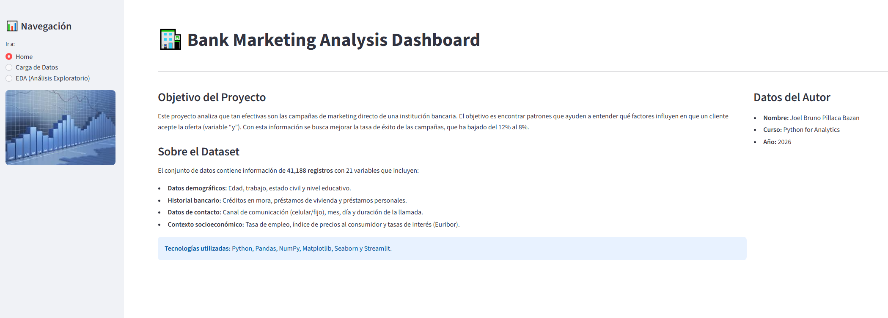
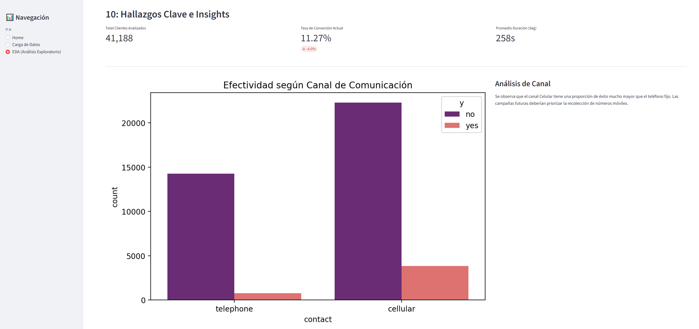

# 🏦 Bank Marketing Analysis Dashboard


## 📝 Descripción del Proyecto
Este proyecto profesional analiza la efectividad de las campañas de marketing directo de una institución financiera. El objetivo es identificar los factores que influyen en la conversión de clientes para revertir la caída del éxito de campaña (del 12% al 8%).

## 🖼️ Capturas de la Aplicación


*Interfaz principal*


*Análisis exploratorio*

## 📁 Estructura del Repositorio
```bash
Bank-Marketing-Portafolio/
├── app.py                     # Código principal de la aplicación Streamlit
├── README.md                  # Documentación del proyecto (este archivo)
├── requirements.txt           # Librerías necesarias para el despliegue
├── images.png                 # Logo de marca personal utilizado en el sidebar
└── BankMarketing.csv          # Dataset con la información de la campaña
